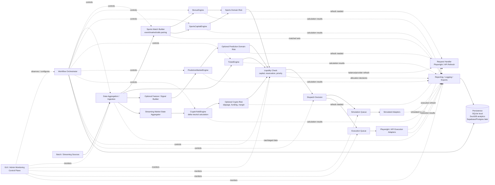

# Q-Bet Pipeline Architecture

This document illustrates the current target architecture for Q-Bet. The source of truth remains `docs/expectation-model.md`; this file exists to make the pipeline easier for humans and agents to follow.

## Pipeline Model

Q-Bet is a workflow-orchestrated pipeline. Not every engine uses every stage. Each engine should take the shortest useful path from data aggregation to calculation, risk checks, liquidity checks, and simulation or execution.

## Responsibilities

- `WorkflowOrchestrator` controls pipeline movement, routing, correlation ids, stage transitions, and engine activation or throttling from GUI settings.
- `RequestHandler` performs targeted Playwright/API refresh checks for Domain Risk, Liquidity Check, and Execution. It is a side channel, not the main intake stream.
- `LiquidityChecker` is the future target name for the current capital allocation role. It checks capital, reservations, priority, balances, provider/account availability, and pending/recheck decisions.
- Reporting, logging, and persistence are cross-cutting. They record pipeline state, but they are not a final numbered layer.
- Simulation and Execution are sibling targets. They use separate queues and separate result histories so simulated runs and real execution do not mix.

## Engine Paths

- `BonusEngine` and `SportsCapitalEngine`: Data Aggregation -> Sports Match Builder -> Calculation -> Sports Domain Risk -> Liquidity Check.
- `TicketEngine`: Data Aggregation -> TicketEngine -> Liquidity Check.
- `PredictionMarketEngine`: Data Aggregation -> optional Feature/Signal Builder -> PredictionMarketEngine -> optional Domain Risk -> Liquidity Check.
- `CryptoYieldEngine`: Streaming Data -> Market State Aggregator -> CryptoYieldEngine -> optional Crypto Risk -> Liquidity Check.

## GUI Plane

The GUI is the Admin Control and Monitoring Plane. It observes pipeline state, data ingestion, simulation runs, execution queue, bank/funding state, warnings, reports, exports, and approvals.

The GUI must not bypass `WorkflowOrchestrator` or directly mutate engine/calculation state.
