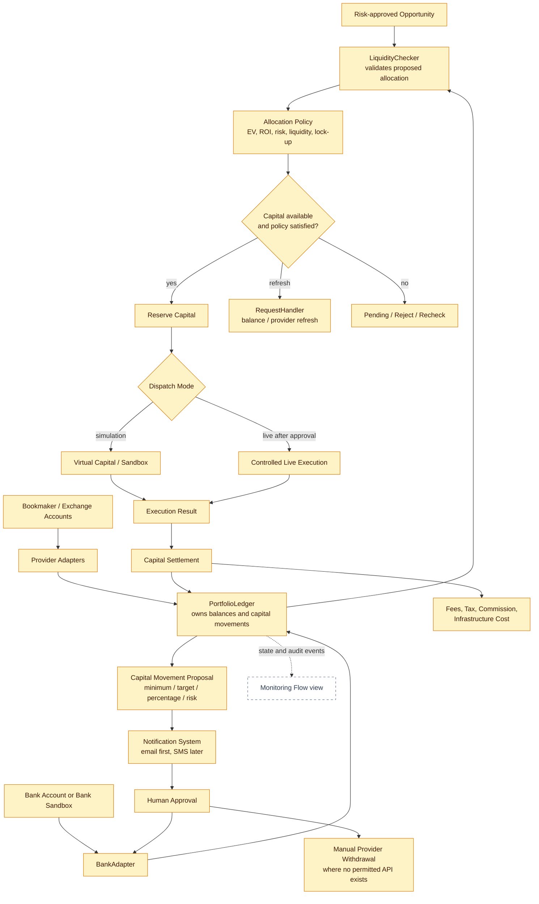
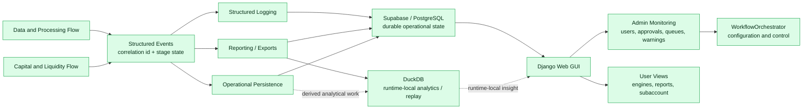

# Q-Bet Pipeline Architecture

This document provides four complementary views of the current Q-Bet target architecture. The source of truth remains `docs/expectation-model.md`. Component names in this document are canonical and must be reused in code, tickets, tests, and other diagrams.

## How To Read The Views

- Blue shows the Data and Processing Flow.
- Yellow shows the Capital and Liquidity Flow.
- Green shows the Monitoring and Tracking Flow.
- The System Context view combines the three without repeating their internal detail.
- A boundary marker in one view points to a responsibility expanded in another view. It is not a second implementation of that component.

## 1. Data And Processing Flow

This view answers: how does an opportunity move from provider data to a simulation or execution result? `WorkflowOrchestrator` controls movement but is intentionally omitted from the main line so the processing path remains readable.

```mermaid
flowchart LR
    sources["Conformant REST / WebSocket APIs<br>Result Data APIs"] --> ingestion["Data Aggregation"]
    ingestion --> preparation{"Engine-specific Preparation"}
    preparation --> sportsPrep["Sports Match Builder<br>fixed-odds sportsbook offers"]
    promotion["Promotion / account metadata<br>explicit input or later read-only provider browser"] --> bonusPrep["Bonus preparation"]
    preparation --> predictionPrep["Feature / Signal Builder"]
    preparation --> marketState["Market State Aggregator"]
    preparation --> ticketPrep["Ticket Preparation"]

    sportsPrep --> bonusPrep
    bonusPrep --> bonus["BonusEngine"]
    sportsPrep --> sports["SportsCapitalEngine"]
    ingestion --> exchangePrep["Exchange preparation<br>peer-to-peer market / order book"]
    exchangePrep --> sportsExchange["SportsExchangeEngine<br>planned"]
    predictionPrep --> prediction["PredictionMarketEngine"]
    marketState --> crypto["CryptoYieldEngine"]
    ticketPrep --> ticket["TicketEngine"]

    bonus --> risk["Domain Risk"]
    sports --> risk
    prediction --> risk
    crypto --> risk
    ticket --> risk
    risk --> liquidity["LiquidityChecker"]
    liquidity --> dispatch{"Dispatch Decision"}
    dispatch --> simulation["Simulation Queue<br>and Simulated Adapters"]
    dispatch --> revalidate["Pre-Execution Revalidation<br>odds, balance, provider state"]
    revalidate -->|valid or adjusted| execution["Execution Queue<br>API-first Execution Adapters"]
    revalidate -->|invalid| discard["Discard Execution Plan"]
    simulation --> result["Result / Settlement"]
    execution --> result

    risk -. "reject / recheck" .-> discard
    liquidity -. "reject / recheck" .-> discard
    risk -. "reject simulation plan" .-> simDiscard["Discard Simulation Plan"]
    liquidity -. "reject simulation plan" .-> simDiscard

    liquidity -. "capital boundary" .-> capitalRef["Capital Flow view"]
    result -. "telemetry boundary" .-> trackingRef["Monitoring Flow view"]

    classDef data fill:#dbeafe,stroke:#2563eb,color:#172554;
    classDef boundary fill:#ffffff,stroke:#64748b,color:#334155,stroke-dasharray:5 5;
    class sources,ingestion,preparation,sportsPrep,predictionPrep,marketState,ticketPrep,bonus,sports,prediction,crypto,ticket,risk,liquidity,dispatch,revalidate,execution,discard,simulation,simDiscard,result data;
    class capitalRef,trackingRef boundary;
```

The sports path uses the `Sports Match Builder`; prediction, crypto, and ticket paths use only their useful preparation stages. `RequestHandler` performs targeted requests, not a second batch-ingestion stream. Smart Polling groups provider-efficient requests around event relevance and timing, including baseline discovery, a T-24h candidate check, a T-2h liquidity check, and a final T-15m execution check where configured.

Only live Execution performs mandatory pre-execution revalidation. If odds, balance, provider state, exposure, or timing changed, the plan is recalculated, returned to risk/liquidity checks, adjusted, or discarded. Simulation uses the same rejection semantics for invalid plans but does not trigger live provider refreshes or user notifications.

## 2. Capital And Liquidity Flow

This view answers: where is capital, how is it reserved, and how do execution outcomes return to the ledger? Capital ownership is outside `WorkflowOrchestrator`.

`LiquidityChecker` checks whether an engine proposal can be funded and permitted. `PortfolioLedger` owns financial state and proposes or records capital movements. Bank, exchange, and bookmaker integrations remain adapters. The ledger is the authority for available, working, reserved, locked, and pending capital and records infrastructure costs separately. Execution reports outcomes to `Capital Settlement`; it does not mutate balances independently. Funding and withdrawals require explicit human approval. Where a provider has no permitted withdrawal API, the notification leads to a manual action rather than browser automation.

Operational controls such as active-bet limits, provider exposure limits, deterministic cooldown policies, and recheck states protect capital and system stability. They must be explicit, testable, and compliance-oriented; they must not be designed to conceal automation or evade provider controls.

## 3. Monitoring And Tracking Flow

This view answers: which events are observed, persisted, reported, and exposed in the GUI?

Every important stage transition, calculation result, risk decision, allocation decision, approval, simulation result, execution result, and settlement emits structured events with a correlation id. Supabase/PostgreSQL is the durable operational source of truth used by normal local and hosted Q-Bet runtimes. DuckDB serves runtime-local analytics, replay, backtesting, and larger transient analytical workloads; local and Vercel DuckDB contexts are separate and are not synchronized.

Any result that must survive runtime termination or be visible across local and hosted application instances is persisted to PostgreSQL. SQLite is not part of the active architecture and exists only as a one-time legacy import source.

The GUI observes and configures the system through `WorkflowOrchestrator`. It must never bypass the orchestrator or directly mutate calculation, risk, liquidity, or execution state. Django Admin is the central user/permission administration surface; Q-Bet admin views expose operational monitoring and controls. Normal user views expose their engines, approvals, reports, and assigned capital/subaccount state.

## 4. System Architecture Context

This view is the compact mental model. Unlike the three behavioral flowcharts, it uses Mermaid's architecture notation to show system areas, external interfaces, and ownership boundaries. Arrows express the dominant direction; undirected links express observation or shared state rather than another workflow.

The pipeline remains the product's processing spine. `PortfolioLedger` is a separate capital authority connected through `LiquidityChecker` and adapters. `WorkflowOrchestrator` controls movement but owns neither calculations nor money. The monitoring plane observes both the pipeline and capital domain. Supabase/PostgreSQL owns durable operational state; DuckDB remains per-runtime analytical infrastructure. API-capable exchanges and prediction markets connect directly to execution adapters; softbookers and ticket providers remain manual-first and may later use narrowly scoped, permitted browser execution.

## Canonical Responsibilities

- `WorkflowOrchestrator`: routing, correlation ids, stage transitions, engine activation, throttling, and GUI-originated control.
- `RequestHandler`: optional targeted refresh checks for risk, liquidity, and execution.
- `Data Aggregation`: structured REST/WebSocket intake and normalization; no quotation scraping.
- `Sports Match Builder`: validated event, market, bookmaker BACK, and exchange LAY pairing.
- Calculation engines: deterministic typed strategy evaluation without database, balance, session, GUI, or execution dependencies.
- `Domain Risk`: provider, account, timing, market, exposure, and strategy policy decisions after calculation.
- `LiquidityChecker`: capital availability, reservation, allocation priority, provider/account availability, pending, and recheck decisions.
- `Portfolio Ledger`: authoritative available, reserved, locked, pending, cost, and settlement state within the liquidity domain.
- Simulation and Execution: sibling dispatch targets with separate queues, adapters, histories, and capital contexts.
- Monitoring and Tracking Plane: structured events, logging, persistence, reports, exports, GUI visibility, and human approvals.

## Canonical Engine Paths

- `BonusEngine` and `SportsCapitalEngine`: `Data Aggregation` -> `Sports Match Builder` -> calculation -> `Domain Risk` -> `LiquidityChecker`.
- `TicketEngine`: `Data Aggregation` -> `Ticket Preparation` -> `TicketEngine` -> `Domain Risk` where required -> `LiquidityChecker`.
- `PredictionMarketEngine`: `Data Aggregation` -> optional `Feature / Signal Builder` -> `PredictionMarketEngine` -> optional `Domain Risk` -> `LiquidityChecker`.
- `CryptoYieldEngine`: streaming `Data Aggregation` -> `Market State Aggregator` -> `CryptoYieldEngine` -> optional `Domain Risk` -> `LiquidityChecker`.

## Sportsbook And Betting-Exchange Boundary

`BonusEngine` and `SportsCapitalEngine` operate on fixed-odds sportsbook offers. `SportsExchangeEngine` is a separate planned peer-to-peer venue engine with exchange-specific BACK/LAY, order-book, liquidity, commission, and matched/unmatched-order semantics.

An exchange API does not expose sportsbook brands such as Tipico or Bwin as selectable bookmaker counterparties. Promotion/account metadata required by BonusEngine is separate from market quotations. Where no supported structured API exists, a later Phase 3 provider-specific read-only browser adapter may supply that metadata from the user's own configured sportsbook account. Browser order placement remains Phase 4 and stays behind the existing approval, revalidation, risk, liquidity, and execution boundaries.
